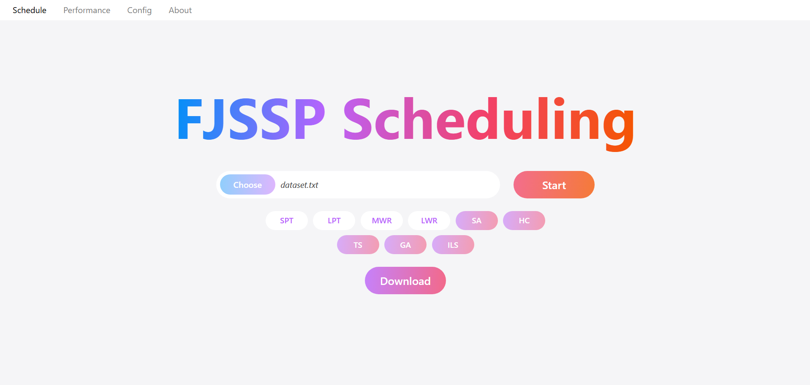
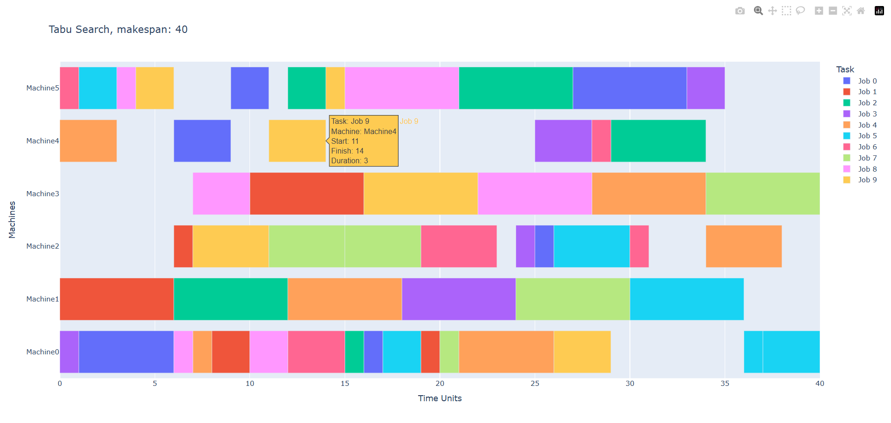
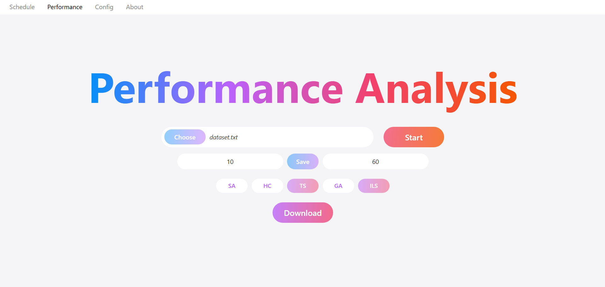
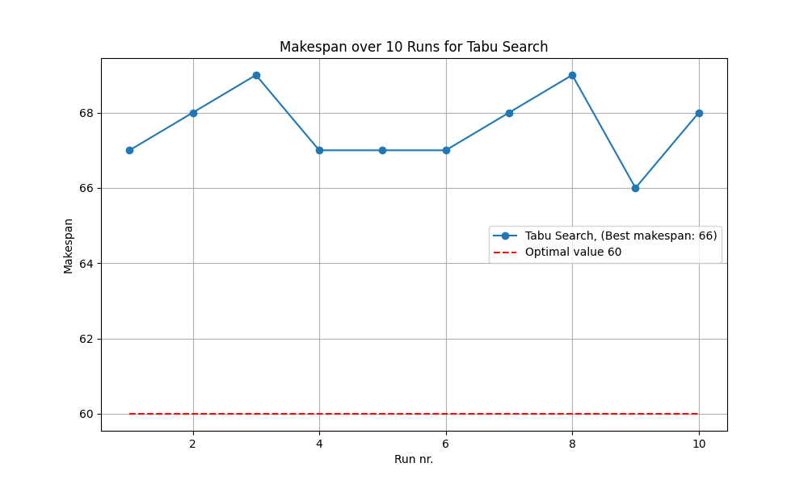
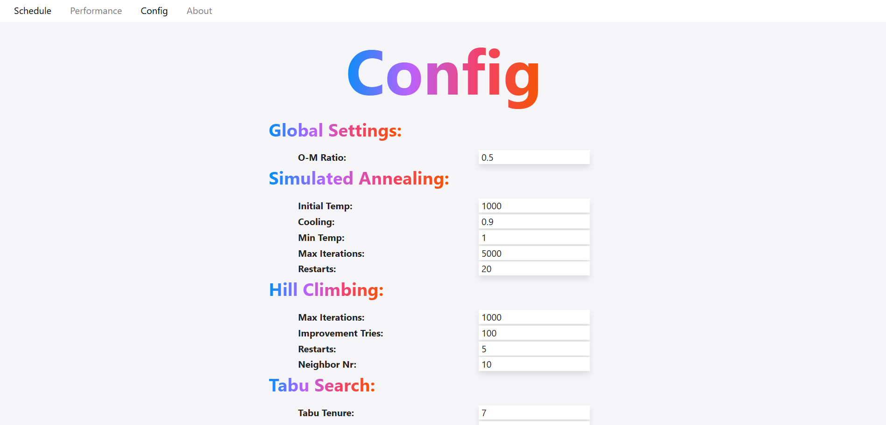

# FJSSP Scheduling Application

A React-based web application for solving Flexible Job Shop Scheduling Problems (FJSSP). This application provides an interface to upload job scheduling data, visualize and download results, run various optimization algorithms, analyse algorithm performance, and configure algorithm parameters.

## Prerequisites

- Node.js (v20.18.0 or later)
- npm (v11.3.0 or later)
- .NET Core backend running on https://localhost:7179 (separate project)

## Dependencies

- React 19
- TypeScript 5.8
- Vite 6.3
- Axios for API requests
- React Router for navigation


## Installation

1. Clone the repository:
   ```
   git clone <repository-url>
   cd FJSSP_React
   ```

2. Install dependencies:
   ```
   npm install
   ```

## Running the Application

1. Make sure the .NET Core backend is running at https://localhost:7179

2. Start the development server:
   ```
   npm run dev
   ```

## Usage Guide

### Home Page
- Upload a .txt file with FJSSP data
- Select desired algorithms to run
- Click "Start" to process the file
- Get generated Gantt Charts
- Download generated schedules

### Analysis Page
- Upload a .txt file with FJSSP data
- Set the number of runs and optimal value
- Select algorithms to analyse
- Click "Start" to run the comparison
- Download performance charts

### Config Page
- Adjust parameters for each algorithm
- Save configurations to be used in future scheduling runs

## Screenshots

Here are some screenshots of the application:











